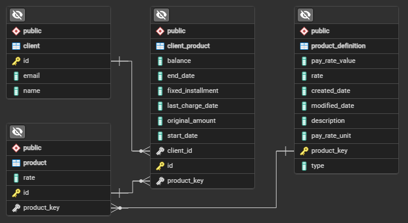

# BankingTest

Using Spring, PostgreSQL, Hibernate, Maven. Postman used for API testing.

## Entity-Relationship Diagram (ERD) - generated in pgAdmin



## API Documentation (selected endpoints)

### Create/Update Product Definitions

Endpoint: /api/product-definitions

Method: POST

```json
{
    "definitions": [
    {
      "operation": "N",
      "productKey": "CL48S5",
      "description": "consumer loan",
      "type": "LOAN",
      "rate": 0.12,
      "payRate": {
        "unit": "MONTH",
        "value": "3"
      }
    },
    {
      "operation": "N",
      "productKey": "PA004A",
      "description": "personal account",
      "type": "ACCOUNT",
      "rate": 150,
      "payRate": {
        "unit": "DAY",
        "value": "14"
      }
    },
    {
      "operation" : "U",
      "productKey": "MO0154",
      "rate": 0.06,
      "payRate": {
        "unit": "MONTH",
        "value": "1"
      }
    },
    {
      "operation" : "U",
      "productKey": "CL9841",
      "rate": 0.09,
      "payRate": {
        "unit": "DAY",
        "value": "21"
      }
    }
  ]
}
```

Responses: 200 OK (500 Error)

### Triggers the fee evaluation (for testing)

Endpoint: /api/fee-evaluation/evaluate

Method: POST 

Responses: 200 OK (500 Error)

### Create client

Endpoint: /api/clients

Method: POST 

```json
{
	"name": "Client 1",
    	"email": "client1@gulugulu.com"
}
```

Response: 200 OK || (500 Error)

```json
{
    "id": 1,
    "name": "Client 1",
    "email": "client1@gulugulu.com",
    "clientProducts": null
}
```

### Create product

Endpoint: api/products?productKey=PA1234&customRate=-100

Method: POST

Response: 200 OK || (500 Error)

```json
{
    "id": 2,
    "productDefinition": {
        "productKey": "PA1234",
        "description": "personal account",
        "type": "ACCOUNT",
        "rate": 150.00,
        "payRate": {
            "unit": "DAY",
            "value": 14
        },
        "createdDate": "2024-05-20T00:45:19.166383Z",
        "modifiedDate": "2024-05-20T00:45:19.166383Z",
        "payRateUnit": "DAY",
        "payRateValue": 14,
        "rateType": "fixed"
    },
    "rate": -100
}
```

### Create client product

Endpoint: api/client-products?productId=1&initialBalance=1000000&startDate=2024-01-01&endDate=2025-01-01&fixedInstallment=500&clientId=1&loanAmount=10000

Method: POST

Response: 200 OK || (500 Error)

```json
{
    "id": 1,
    "client": {
        "id": 1,
        "name": "Client 1",
        "email": "client1@gulugulu.com",
        "clientProducts": []
    },
    "product": {
        "id": 1,
        "productDefinition": {
            "productKey": "PA1234",
            "description": "personal account",
            "type": "ACCOUNT",
            "rate": 150.00,
            "payRate": {
                "unit": "DAY",
                "value": 14
            },
            "createdDate": "2024-05-20T00:45:19.166383Z",
            "modifiedDate": "2024-05-20T00:45:19.166383Z",
            "payRateUnit": "DAY",
            "payRateValue": 14,
            "rateType": "fixed"
        },
        "rate": 200.00
    },
    "balance": 1000000,
    "originalAmount": 10000,
    "fixedInstallment": 500,
    "startDate": "2024-01-01",
    "endDate": "2025-01-01",
    "lastChargeDate": "2024-01-01",
    "productDefinition": {
        "productKey": "PA1234",
        "description": "personal account",
        "type": "ACCOUNT",
        "rate": 150.00,
        "payRate": {
            "unit": "DAY",
            "value": 14
        },
        "createdDate": "2024-05-20T00:45:19.166383Z",
        "modifiedDate": "2024-05-20T00:45:19.166383Z",
        "payRateUnit": "DAY",
        "payRateValue": 14,
        "rateType": "fixed"
    },
    "customRate": 350.00,
    "rate": 200.00,
    "dueForCharge": true
}
```
